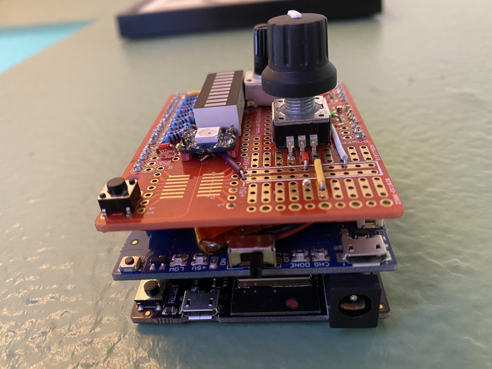

# HUE Rotary Light Switch
This is my fifth or so light switch that integrates with Philips HUE. With this
build I wanted to:

- Create something tactile (knobs and buttons).
- Provide meaningful feedback for the changes being made.
- No plugs necssary to work.

I ended on two main controls besides an on/off switch:

- A potentiometer that controls brightness, displayed using an LED Bar Grid.
- A rotary knob that controls color, displayed using a LED NeoPixel.

Pressing the rotary generates the instructions and sends to the various lights
(I have this currently configured to control deck lighting as well as living
room, where the living room lighting is roughly half as bright). Where the LED
NeoPixel displays a single color, it is used only as an anchor, allowing some
variation in color per light to create a unique atmosphere with every push of
the rotary.

## Components
- Adafruit M4 Express w/ AirLift ESP32 WiFi Co-Processor
- Potentiometer controls LED Bar Grid
- Rotary+ controls NeoPixel
- Adafruit PowerBoost 500 Shield
- Gikfun Prototype Shield

## Construction
This project involved building a proper Arduino "tower". M4 Board, PowerBoost
Shield, and Prototype Shield--all being Arduino R3 pinout compatible--were
stacked on top of each other. The prototype shield was placed on top, with all
components soldered directly on it for a durable and compact build. The
remaining two layers were drilled/anchored to the wall, alowing for the top
layer to gently be removed, revealing the lithium ion battery that could be
swapped out when discharged. The entire unit also can be plugged into USB to
recharge the existing battery. While this did mean relying on an on/off switch
(placed on the "bottom" of the PowerBoost Shield), appearing completely
wire-free to operate felt aesthetically correct for a light switch.

## Diagrams

## Demo

