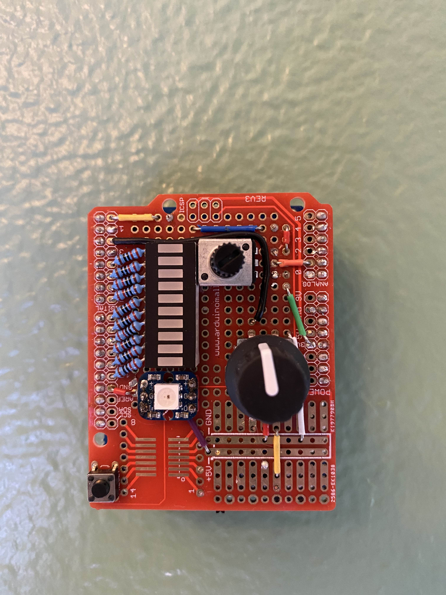

# HUE Rotary Light Switch
Wire-free rechargable light switch for Philips HUE.

Two knobs to control brightness and color. LED NeoPixel and LED Bar Grid
provide feedback on configuration. Pressing the rotary generates and sends
instructions to various lights, allowing for some variation in color per light.
This creates a unique atmosphere with every push of the button.

## Components
- Adafruit M4 Express w/ AirLift ESP32 WiFi Co-Processor
- Potentiometer controls LED Bar Grid
- Rotary+ controls NeoPixel
- Adafruit PowerBoost 500 Shield
- Gikfun Prototype Shield

## Construction
This project involved building a proper Arduino tower. M4 Board, PowerBoost
Shield, and Prototype Shield; all being Arduino R3 pinout compatible allowed
for stacking each layer. The prototype shield on top allowed for directly
soldering components that made up the switch. Bottom two layers were
drilled/anchored to the wall, alowing for the top layer to lift up revealing
the lithium ion battery to be swapped out. The entire unit also can be plugged
into USB to recharge the existing battery.

## Diagrams

## Demo

