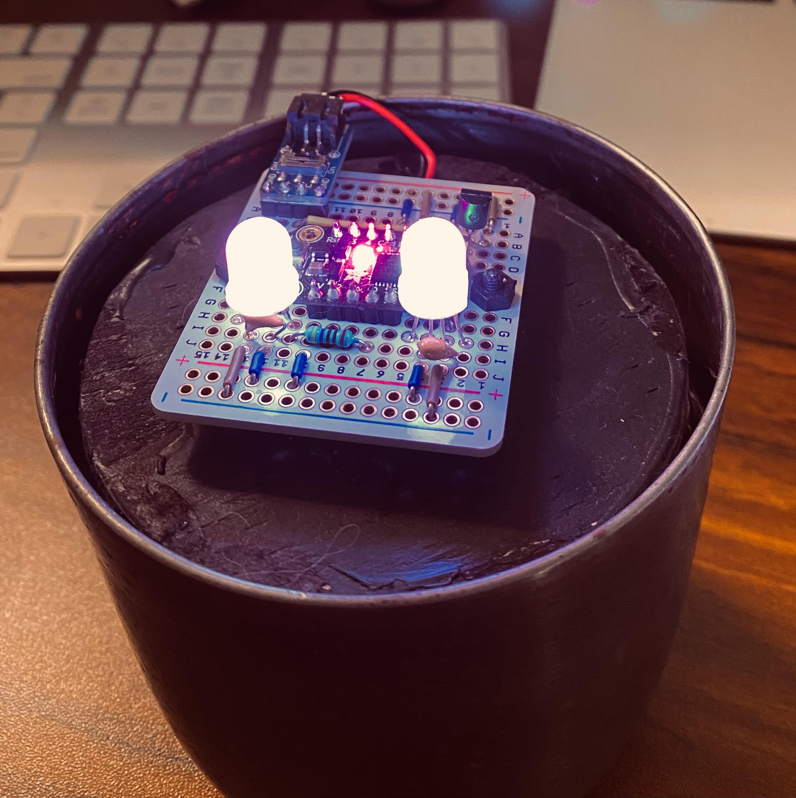
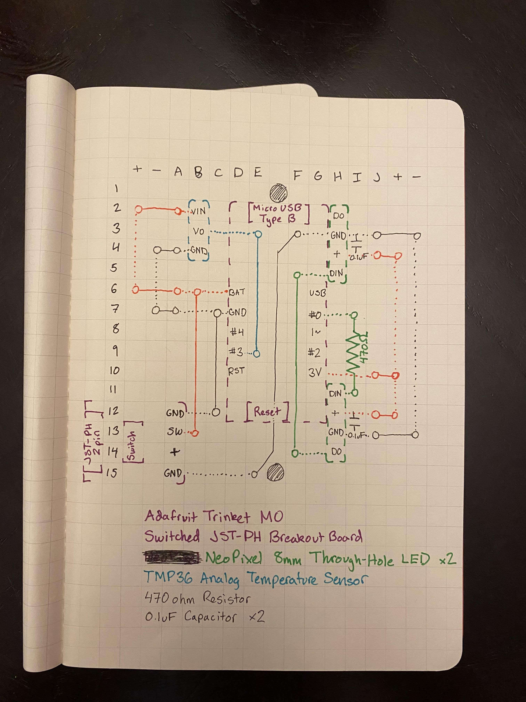

# LED Candle
Flickers using a heat color spectrum. Factors in temperature from a sensor that
affects flame color (warmer favors oranges and reds, colder favors whites and
greens).

Powered by Micro USB or Lithium Ion Battery with switch.

## Components
- Adafruit Trinket M0
- Adafruit Switched JST-PH Breakout Board
- TMP36 Temperature Sensor
- NeoPixel 8mm Through-Hole LED (x2)

## Construction
I reused some old metal candleholders I had, cutting out a piece of wood that
the unit could comfortably sit on. I used Adafruit protoboard, feeding the
wiring through to house the battery beneath.

## Diagrams

## Demo

