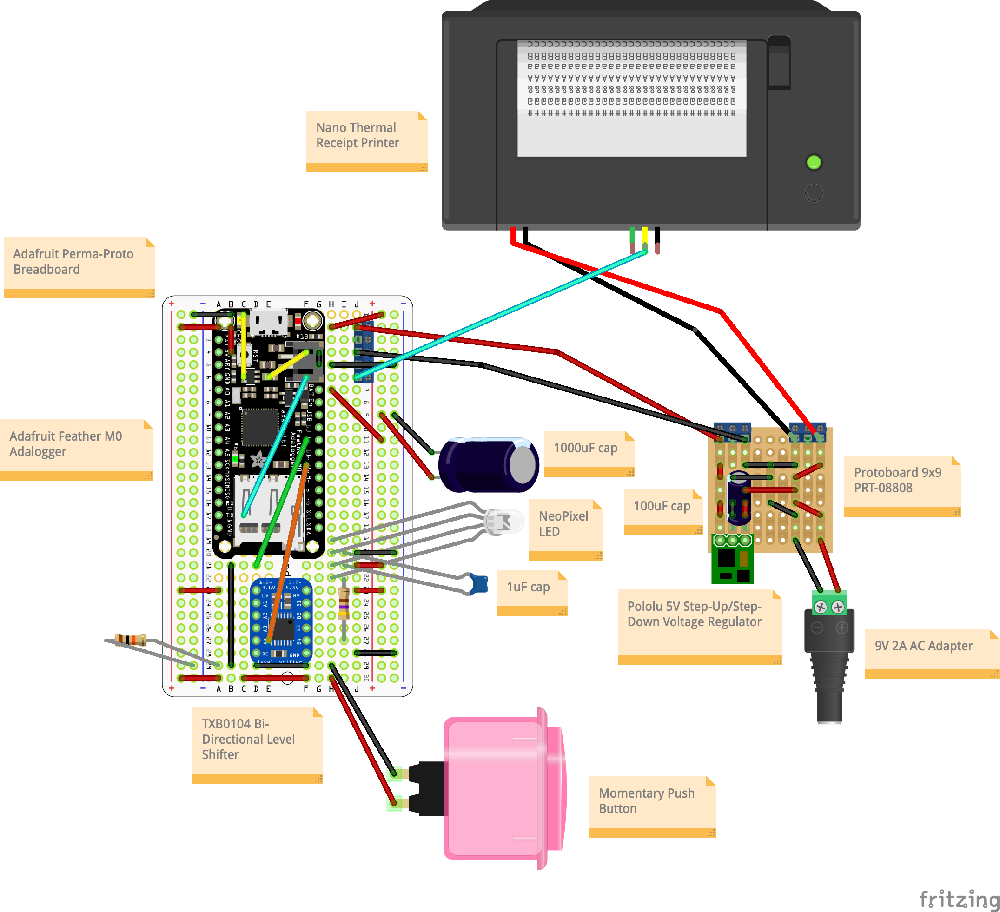

# Printer
With a push of a button, prints text files from micro SD to thermal receipt.
Provides some feedback with an LED light.

## Components
- Adafruit Feather M0 Adalogger
- Nano Thermal Receipt Printer
- TXB0104 Bi-Directional Level Shifter
- Pololu 5V Step-Up/Step-Down Voltage Regulator
- NeoPixel Diffused 8mm Through-Hole LED

## Construction
This project really became an exercise in power/voltage management, having
different requirements from various components:

- Nano Printer [5-9V, 1.5A]
- Feather M0 [3.3V logic, 3-5V, 0.5A]
- NeoPixel [5V logic]

Early attempts tried to share 5VDC between the printer and microcontroller.
This was not enough, causing the printer to stop while the MicroSD card was
accessed. As an alternative, I went with a 9V/2A adapter, feeding the power
directly to the printer. It would also pass through a regulator, which stepped
it down safely to 5V before passing on to the microcontroller battery pin. A
level shifter was added between microcontroller and NeoPixel to provide proper
voltage logic.

## Diagrams

## Libraries

Written for Arduino (C++).

## Programming

## Demo
